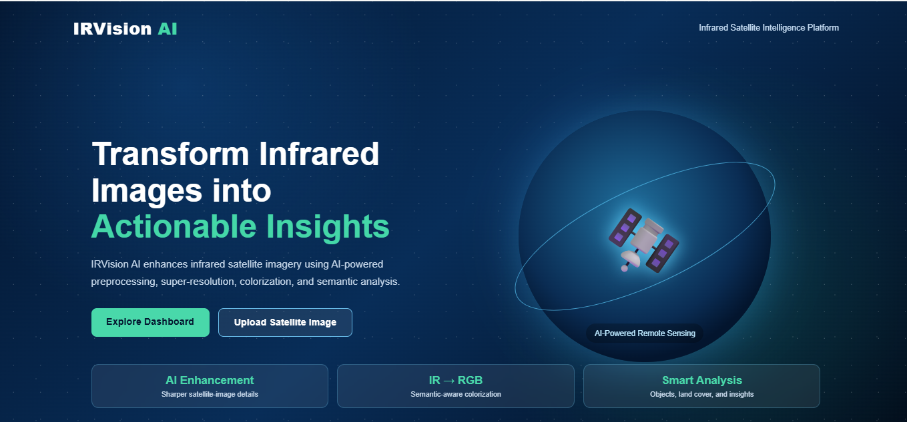
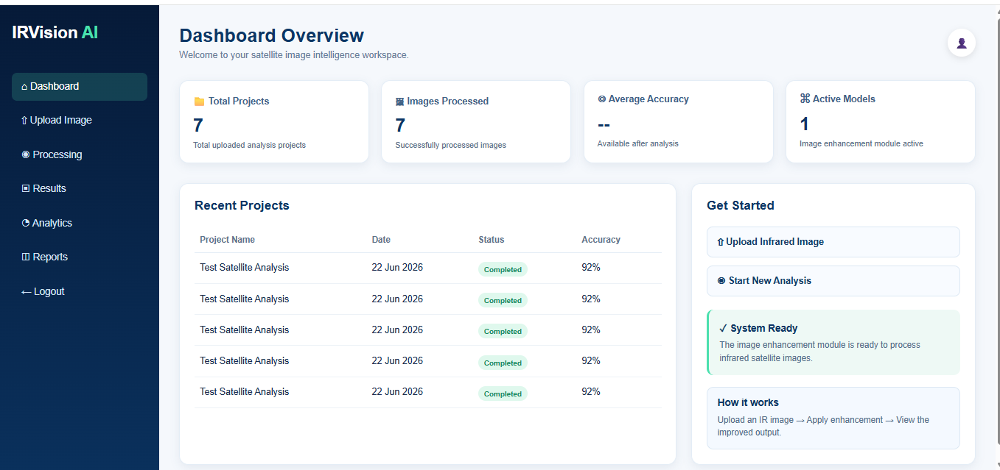
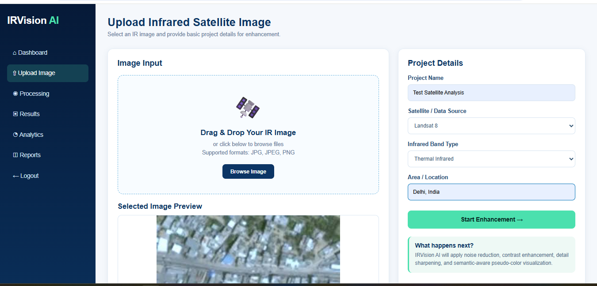
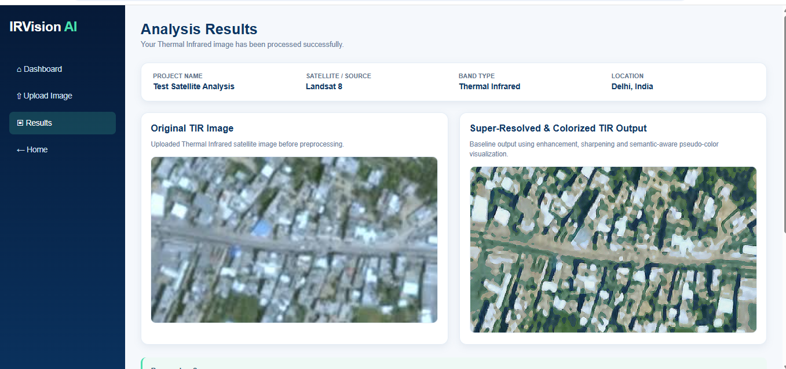

# 🚀 IRVision AI

<p align="center">

**AI-Powered Infrared Image Colorization & Enhancement for Improved Object Interpretation**

*A Django-based prototype for enhancing and visualizing Thermal Infrared (TIR) satellite imagery.*

</p>

---

## 📖 Project Overview

IRVision AI is an open-source web application designed to improve the interpretation of Thermal Infrared (TIR) satellite imagery. The system enhances infrared images using advanced image processing techniques and generates semantic pseudo-color visualizations that make objects easier to interpret.

This project serves as a prototype for future AI-based super-resolution and infrared-to-RGB colorization using paired Landsat satellite datasets.

---

## ✨ Features

* 📤 Upload Thermal Infrared (TIR) satellite images
* 🎨 Semantic pseudo-color visualization
* 🔍 Contrast enhancement using CLAHE
* ✨ Image sharpening using OpenCV
* 🖼️ Original vs Enhanced image comparison
* 📊 Interactive dashboard
* 📁 Project history management
* 💻 Clean and responsive user interface

---

## 🛰️ Problem Statement

Thermal Infrared (TIR) satellite images are difficult to interpret because they are low-resolution and lack natural colors. This project aims to improve visual interpretation by enhancing image quality and generating meaningful pseudo-color outputs, helping users better analyze geographical features.

---

## 🛠️ Technology Stack

| Category         | Technology            |
| ---------------- | --------------------- |
| Backend          | Python, Django        |
| Frontend         | HTML, CSS, JavaScript |
| Image Processing | OpenCV, NumPy         |
| Database         | SQLite                |
| Version Control  | Git & GitHub          |

---

## 📂 Project Structure

```text
IRVision-AI/
│
├── image_processor/
├── irvision_project/
├── templates/
├── media/
├── screenshots/
├── manage.py
├── requirements.txt
└── README.md
```

---

## ⚙️ Installation

### Clone the repository

```bash
git clone https://github.com/mahi17916/IRVision-AI.git
```

### Move into project directory

```bash
cd IRVision-AI
```

### Install dependencies

```bash
pip install -r requirements.txt
```

### Apply migrations

```bash
python manage.py migrate
```

### Run the server

```bash
python manage.py runserver
```

Open your browser:

```
http://127.0.0.1:8000/
```

---

# 📸 Screenshots

## 🏠 Home Page



---

## 📊 Dashboard



---

## 📤 Upload Image



---

## 🛰️ Analysis Results



---

## 🚀 Future Scope

* Deep Learning based Pix2Pix GAN implementation
* AI-based Super Resolution
* Landsat 8/9 Dataset Integration
* PSNR, SSIM & FID Evaluation
* User Authentication
* Cloud Deployment
* Interactive Analytics Dashboard

---

## 🌍 Applications

* Disaster Management
* Agriculture Monitoring
* Forest Analysis
* Urban Planning
* Water Body Detection
* Environmental Monitoring

---

## 👩‍💻 Author

**Mahi Kakkar**

B.Tech (Internet of Things)

Open Source & AI Enthusiast

GitHub: https://github.com/mahi17916

---

## 🤝 Contributing

Contributions are welcome!

Feel free to fork the repository, improve the project, and submit a Pull Request.

---

## ⭐ Support

If you found this project useful, please consider giving it a **Star ⭐** on GitHub.

---

## 📄 License

This project is licensed under the **MIT License**.
